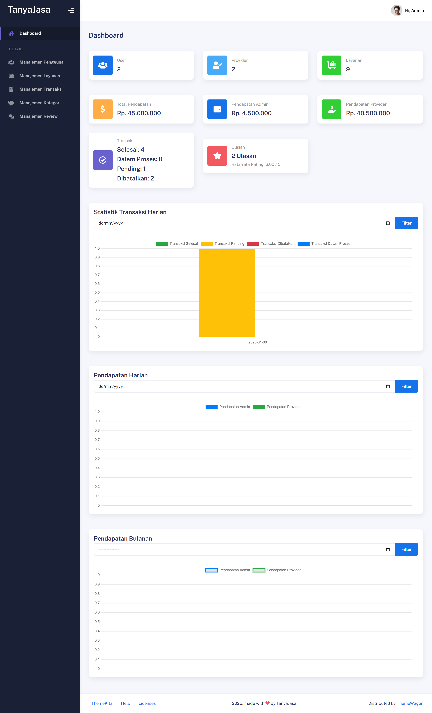

# TanyaJasa - Marketplace Layanan Jasa - Proyek Mata Kuliah Pemrograman Berbasis Web

## Deskripsi Proyek

TanyaJasa adalah sebuah platform marketplace untuk layanan jasa yang menghubungkan penyedia jasa (provider) dengan pengguna jasa (user). Platform ini dirancang untuk memberikan pengalaman transaksi yang mudah dan transparan dengan fitur-fitur seperti manajemen transaksi, statistik pendapatan, dan laporan dalam format PDF.

## Anggota Kelompok

1. **ALIP RIZKY FIRDAUS [220660121078]**
2. **RIFAN WAROSY SIROJUDIN [220660121033]**
3. **M ARIF FIRMANSYAH [220660121013]**
4. **NAUFAL SIDDIQ RAMADHAN [220660121035]**

## Teknologi yang Digunakan

-   **Laravel 10**: Framework PHP modern yang digunakan untuk membangun aplikasi dengan struktur MVC, menyediakan fitur-fitur canggih seperti routing, middleware, dan ORM (Eloquent).
-   **PHP versi 8 ke atas**: Versi PHP terbaru yang memastikan performa optimal, keamanan, dan kompatibilitas dengan Laravel.
-   **Composer**: Dependency manager untuk PHP, digunakan untuk mengelola pustaka Laravel dan library lainnya.
-   **MySQL**: Basis data relasional yang digunakan untuk menyimpan informasi seperti pengguna, layanan, transaksi, dan kategori jasa.
-   **Bootstrap 5**: Framework CSS untuk membangun antarmuka pengguna yang responsif, modern, dan mudah disesuaikan.
-   **Payment gateway Midtrans**: Platform pembayaran untuk menangani transaksi secara aman dan mendukung berbagai metode pembayaran.
-   **Git & Git Bash**: Sistem kontrol versi yang digunakan untuk mengelola kode proyek dan mempermudah kolaborasi antar anggota tim.
-   **jQuery**: Library JavaScript untuk mempermudah manipulasi DOM, implementasi AJAX, dan berbagai interaksi antarmuka.
-   **DataTables**: Plugin jQuery untuk menampilkan data dalam tabel dengan fitur pagination, sorting, dan filtering.
-   **Sweet Alert 2**: Library untuk menampilkan dialog pop-up yang menarik, seperti notifikasi atau konfirmasi aksi pengguna.
-   **ChartJS**: Library JavaScript untuk membuat visualisasi data dalam bentuk grafik, seperti grafik pendapatan atau transaksi.
-   **Font Awesome 5**: Koleksi ikon yang digunakan untuk mempercantik elemen-elemen visual dalam aplikasi.
-   **Kode native (PHP, HTML, JS, CSS)**: Digunakan untuk implementasi fitur-fitur tambahan yang tidak tersedia secara langsung dalam framework atau library.

## Fitur Utama

-   CRUD untuk user (pembeli), provider, dan admin
-   Pemesanan jasa dan pemberian review
-   Pengelolaan transaksi
-   Pengelolaan kategori jasa
-   Pagination di banyak bagian
-   Searching dan filtering
-   Statistik pendapatan dan laporan PDF

## Alur Penggunaan

### User (Pembeli)

1. Login/Register
2. Memilih jasa
3. Memesan jasa
4. Menunggu konfirmasi admin
5. Setelah konfirmasi, membayar
6. Setelah pembayaran, provider mengerjakan pesanan
7. User memberikan konfirmasi selesai atau batal transaksi

### Provider

1. Login
2. Mengelola jasa dan portofolio
3. Menangani transaksi (status pending, diproses, selesai, batal)

### Admin

1. Login
2. Mengelola manajemen pengguna, layanan, transaksi, kategori, dan review

## Konfigurasi dan Instalasi

### Persyaratan

-   PHP versi 8 ke atas
-   MySQL
-   Composer
-   Node.js dan npm untuk instalasi Bootstrap dan paket lainnya

### Instalasi

1. Clone repository:
    ```bash
    git clone [repository URL]
    ```
2. Navigasikan ke direktori proyek:
    ```bash
    cd TanyaJasa
    ```
3. Install dependensi menggunakan Composer:
    ```bash
    composer install
    ```
4. Salin `.env.example` ke `.env`:
    ```bash
    cp .env.example .env
    ```
5. Konfigurasi database di `.env`:
    ```env
    DB_CONNECTION=mysql
    DB_HOST=127.0.0.1
    DB_PORT=3306
    DB_DATABASE=tanyajasa
    DB_USERNAME=root
    DB_PASSWORD=root
    ```
6. Jalankan migrasi database:
    ```bash
    php artisan migrate
    ```
7. Jalankan server lokal:
    ```bash
    php artisan serve
    ```

## Screenshot Preview



