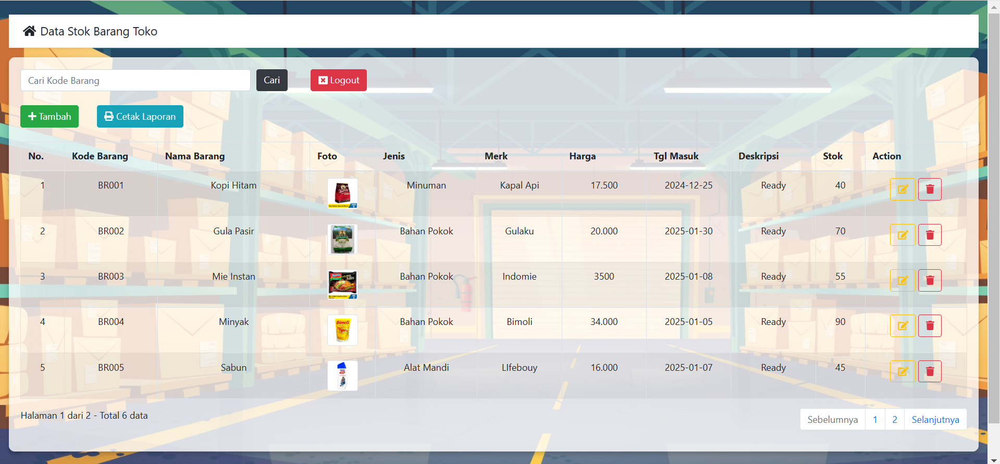
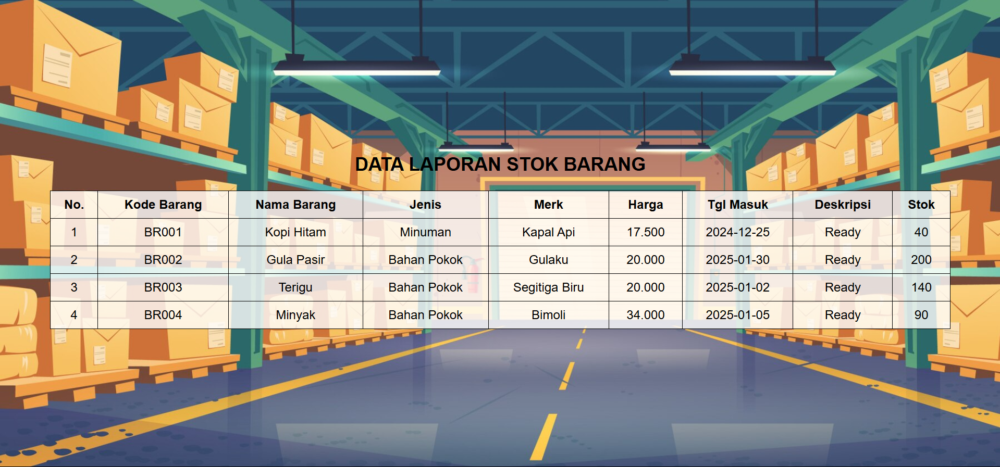
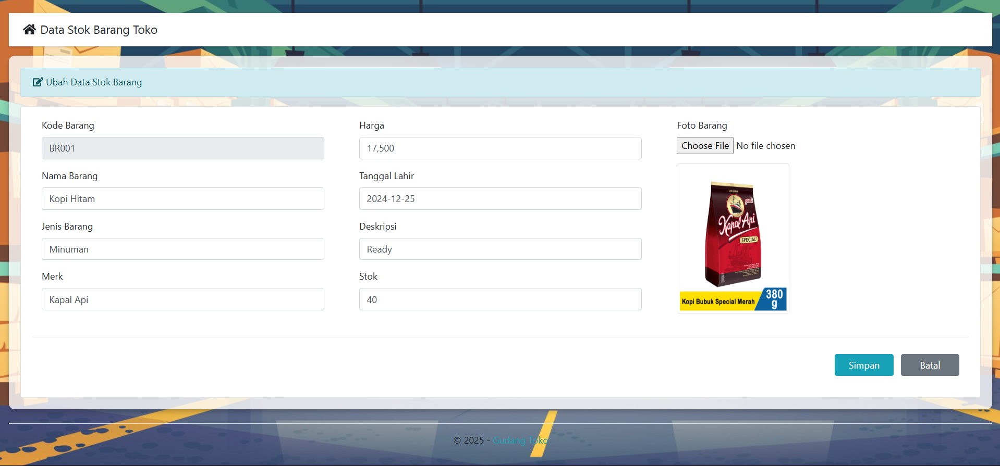
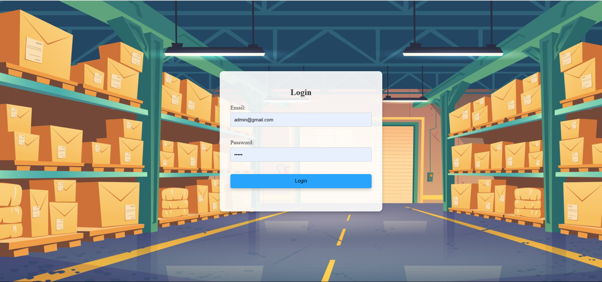
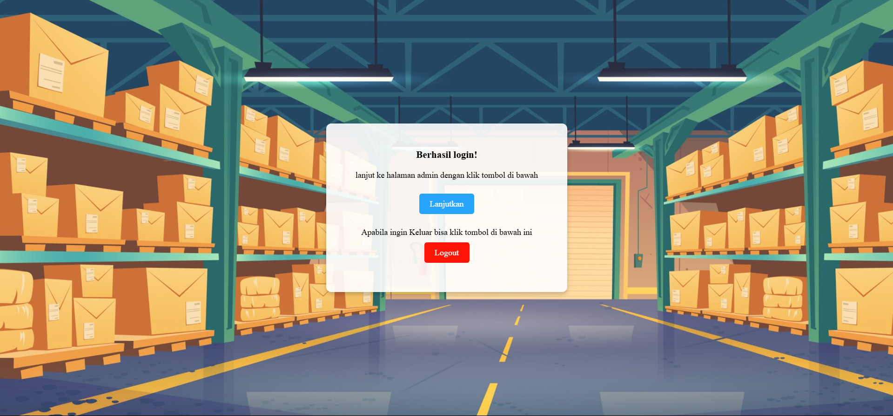
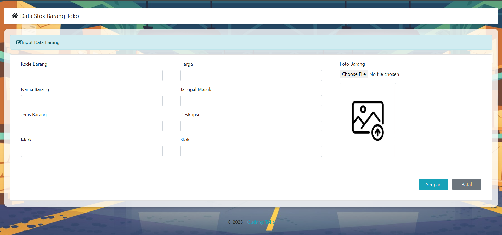

Kelompok 7
- Refandihaz Awaludin 220660121073
- Raka Rey Ferdian 220660121096
- Reza Nurramadhan Suparman 220660121002

# Gudang Management System

Proyek ini merupakan aplikasi manajemen gudang yang memungkinkan pengguna untuk mengelola data barang dengan fitur CRUD (Create, Read, Update, Delete). Aplikasi ini dibangun menggunakan PHP Native dan MySQL.

## Fitur Utama
- Tambah, ubah, hapus, dan lihat data barang.
- Cetak laporan data.
- Sistem login untuk autentikasi pengguna.
- Validasi input untuk memastikan integritas data.

## Teknologi yang Digunakan
- **Backend**: PHP Native
- **Frontend**: HTML, CSS, JavaScript
- **Database**: MySQL

## Kontak
Untuk pertanyaan atau masalah, hubungi tim pengembang melalui email berikut:
- **Email**: 220660121002@student.unsap.ac

---
**Dikembangkan sebagai tugas proyek untuk penerapan CRUD berbasis web.**

5
